# Book a Dental Appointment

## Disclaimer

I have used AI. Product Design (structure), API Integration, UI ideas are mine.

## Project Brief

Help user book a dental appointment.

## Project Statement (As Assigned)

**Objective:** Update code to integrate APIs. Focus on structure, setup optimization, code correctness, validations, errors.

## Steps Included

1. User selects a doctor.
2. User selects an available slot.
3. User enters details.
4. User confirms.
5. Appointment booked.

## API Integration

**API Endpoints:**

```typescript
// 1. Get doctors by facility
GET /providers/search/?facility_id={facilityId}

// 2. Get appointment slots
GET /resource-schedules/resources/{resourceId}/date/{date}

// 3. Register patient
POST /patients/

// 4. Book appointment
POST /appointments/
```

**API Screenshots:**

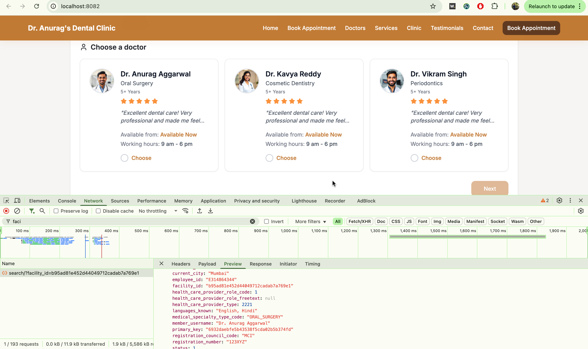
_Facility API Response - Getting doctors by facility ID_

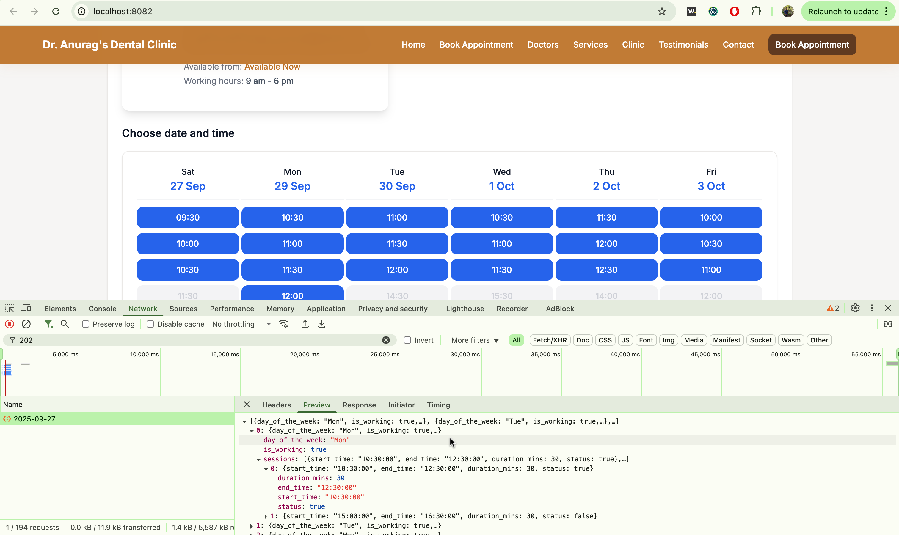
_Date Slot API Response - Getting available appointment slots_

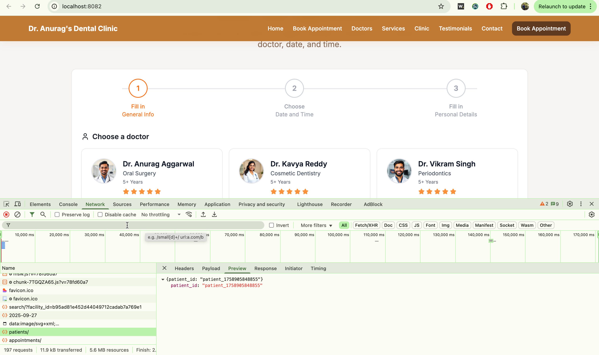
_Patients API Response - Patient registration_

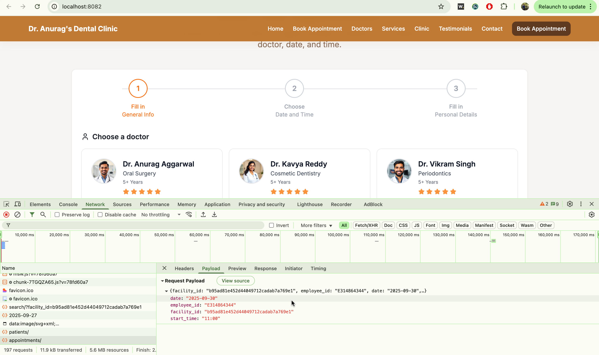
_Appointments API Response - Booking appointment_

### Why I Chose MSW (Mock Service Worker)

1. **Real API Simulation**: MSW intercepts actual HTTP requests at the network level, and provides a more realistic development experience. As visible in the API screenshots, you can check out API calls in Network tab to test the flow.

2. **Development Independence**: MSW allows us to develop and test the frontend without depending on a live backend API.

3. **Simplicity over management**: MSW allows a simple approach to integrate and test APIs over Tanstack React Query. MSW is useful for testing, development without depending on an API whereas Tanstack React Query is useful for querying, caching, synchronizing, and updating server state (would have been useful in a different context).

**How MSW Functions:**

```typescript
// MSW intercepts requests at the network level
const handlers = [
  http.get("/providers/search/", async ({ request }) => {
    // Simulates real API behavior with delays and validation
    await delay(500);
    return HttpResponse.json(MOCK_DOCTORS);
  }),
  // ... other handlers
];
```

**MSW Implementation Details:**

- **Service Worker**: Automatically registers `/mockServiceWorker.js` in development
- **Request Interception**: Intercepts all API calls matching defined patterns
- **Authentication**: Validates Bearer tokens in headers
- **Error Simulation**: Returns appropriate HTTP status codes (400, 401, 404)
- **Realistic Delays**: Simulates network latency (500-800ms)
- **Data Validation**: Validates request parameters and body structure

## Understand User Flow

- Let's understand the user flow.
- I remember Anish mentioned that you want to build a sleek UI for your product. I wanted to go beyond the current task and design a more user intuitive UI for booking an appointment. This is the most crucial part for any doctor. This was my attempt to demonstrate product understanding.

## Application Screenshots

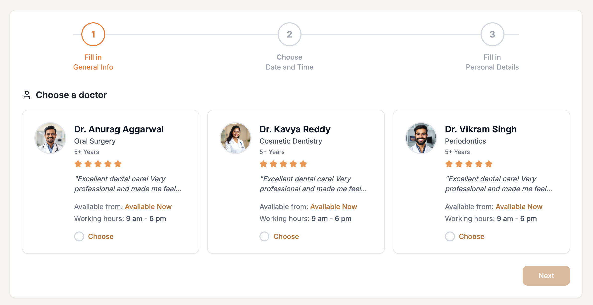
_Step 1: Doctor selection interface_

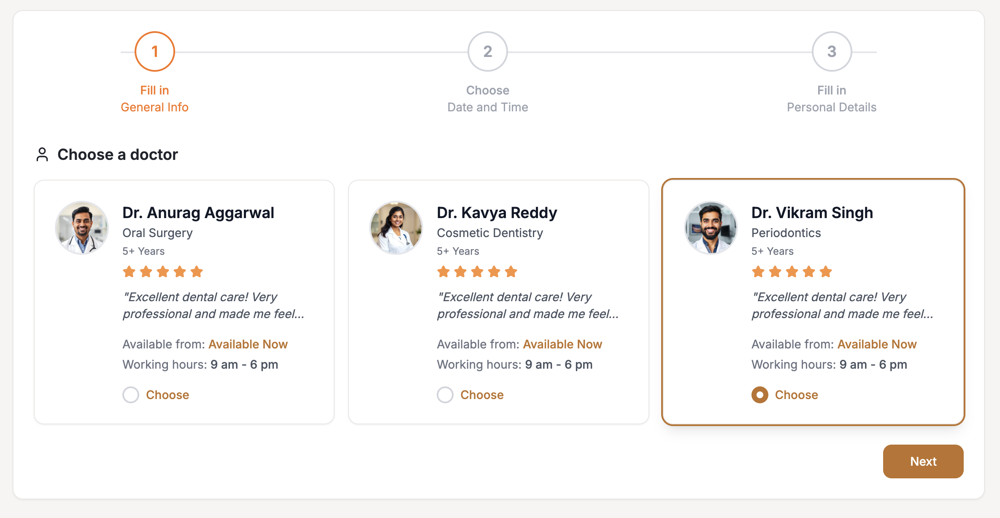
_Step 1: Doctor selected and ready to proceed_

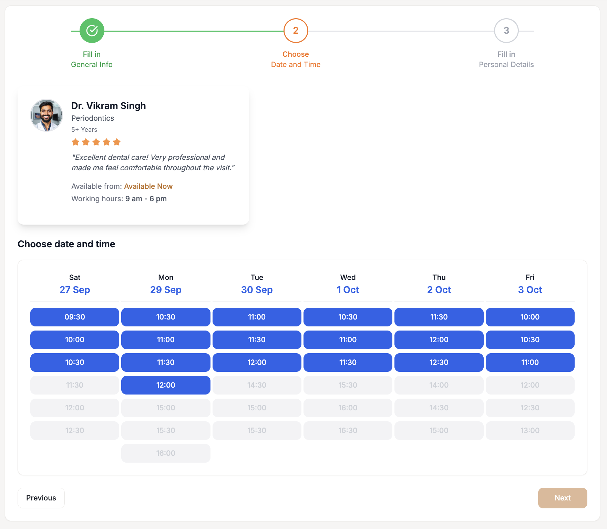
_Step 2: Date and time selection interface_

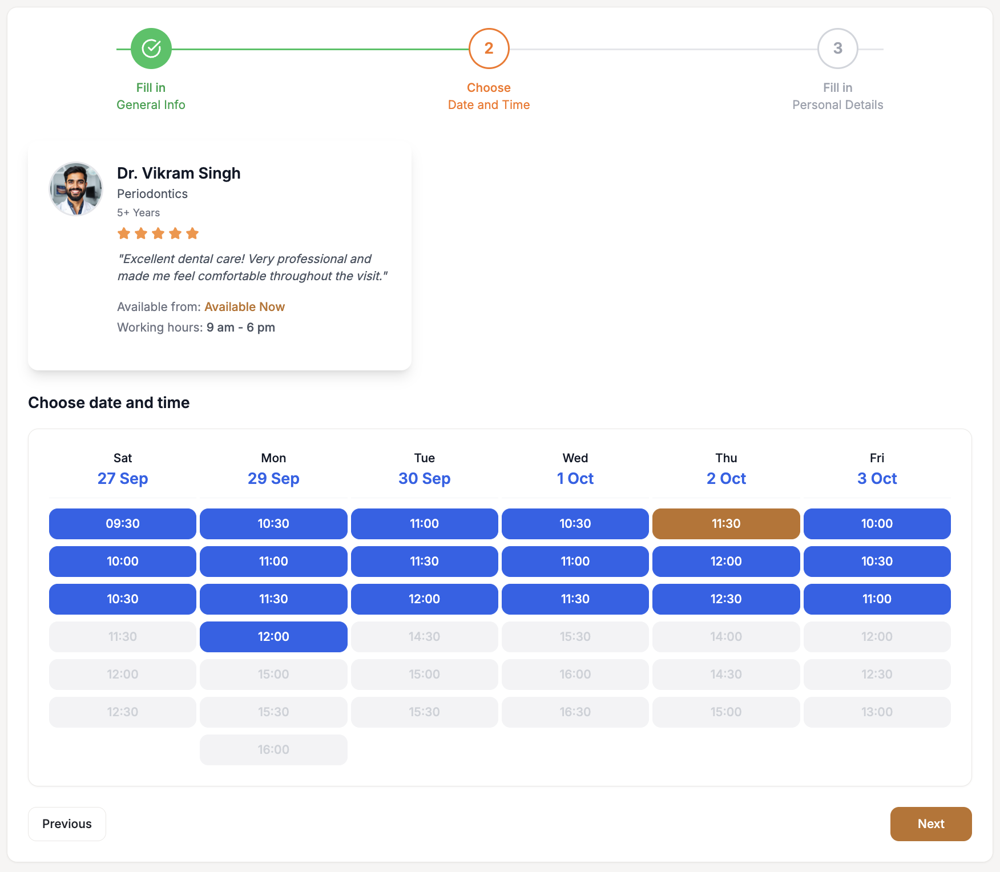
_Step 2: Date and time selected_

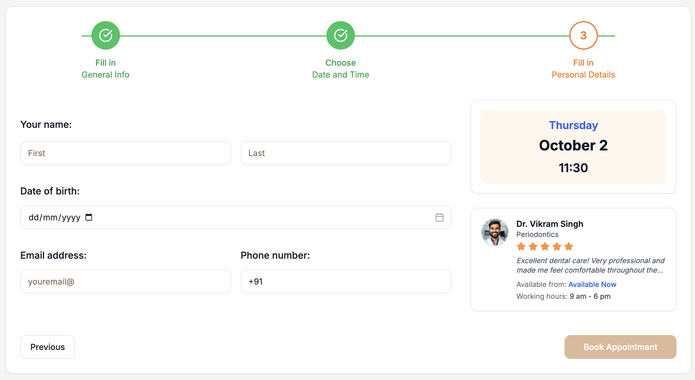
_Step 3: Personal details form_

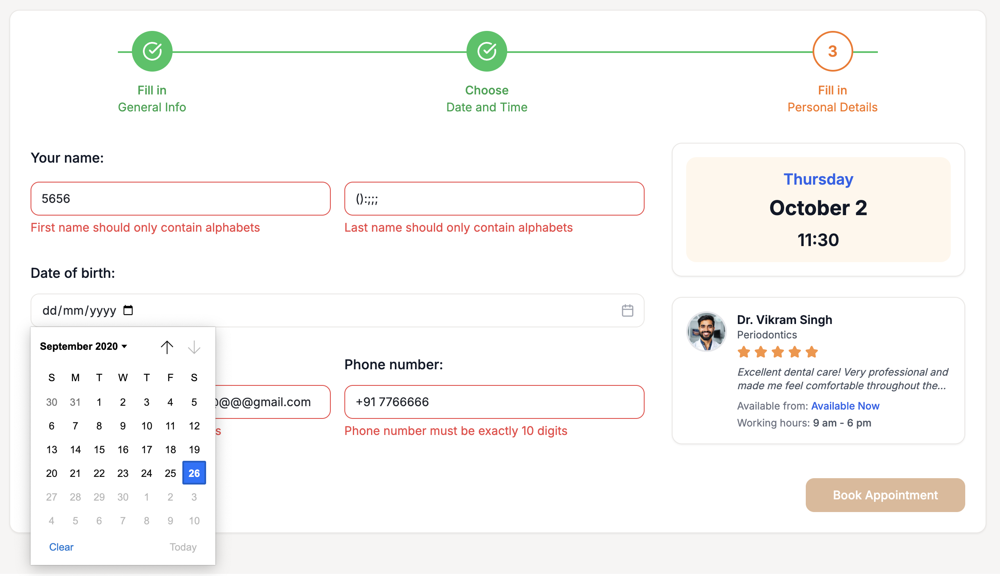
_Step 3: Form validation errors displayed_

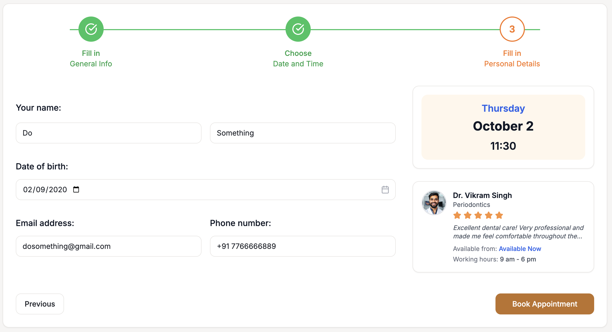
_Step 3: Personal details filled correctly_

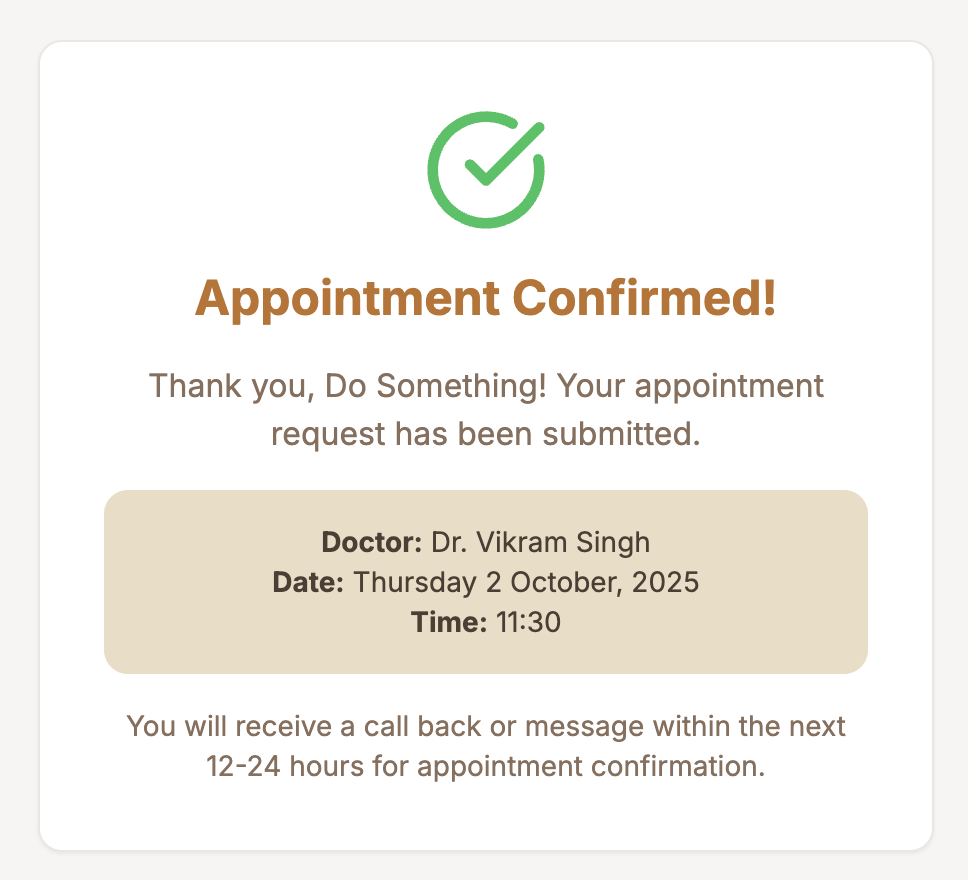
_Step 4: Appointment booking confirmation_

## Possible Improvements

### 1. Enhanced Error Handling & User Experience

**Current State:**

- Basic error alerts for failed API calls
- Limited error state management
- No retry mechanisms for failed requests

**Proposed Improvements:**

- **Toast Notifications**: Replace alert() with elegant toast notifications using Sonner
- **Error Boundaries**: Add React error boundaries to gracefully handle component crashes
- **Offline Support**: Add service worker for offline functionality

### 2. Advanced State Management & Performance

**Current State:**

- Basic useReducer for appointment state
- No caching or persistence
- Limited optimization for re-renders

**Proposed Improvements:**

- **TanStack Query Integration**: Add React Query for server state management, caching, and synchronization
- **Zustand Store**: Implement lightweight state management for global app state
- **React.memo Optimization**: Memoize expensive components to prevent unnecessary re-renders
- **Virtual Scrolling**: For large lists of doctors or appointment slots
- **Data Persistence**: Save form progress in localStorage/sessionStorage

**Additional Enhancement Opportunities:**

- **Analytics**: User behavior tracking and performance monitoring
- **Testing**: Comprehensive unit and integration test coverage

------------------------------- x -----------------------------------------

# Welcome to your Lovable project

## Project info

**URL**: https://lovable.dev/projects/b3b05c67-423f-41db-8fae-89bd9759cde5

## How can I edit this code?

There are several ways of editing your application.

**Use Lovable**

Simply visit the [Lovable Project](https://lovable.dev/projects/b3b05c67-423f-41db-8fae-89bd9759cde5) and start prompting.

Changes made via Lovable will be committed automatically to this repo.

**Use your preferred IDE**

If you want to work locally using your own IDE, you can clone this repo and push changes. Pushed changes will also be reflected in Lovable.

The only requirement is having Node.js & npm installed - [install with nvm](https://github.com/nvm-sh/nvm#installing-and-updating)

Follow these steps:

```sh
# Step 1: Clone the repository using the project's Git URL.
git clone <YOUR_GIT_URL>

# Step 2: Navigate to the project directory.
cd <YOUR_PROJECT_NAME>

# Step 3: Install the necessary dependencies.
npm i

# Step 4: Start the development server with auto-reloading and an instant preview.
npm run dev
```

**Edit a file directly in GitHub**

- Navigate to the desired file(s).
- Click the "Edit" button (pencil icon) at the top right of the file view.
- Make your changes and commit the changes.

**Use GitHub Codespaces**

- Navigate to the main page of your repository.
- Click on the "Code" button (green button) near the top right.
- Select the "Codespaces" tab.
- Click on "New codespace" to launch a new Codespace environment.
- Edit files directly within the Codespace and commit and push your changes once you're done.

## What technologies are used for this project?

This project is built with:

- Vite
- TypeScript
- React
- shadcn-ui
- Tailwind CSS

## How can I deploy this project?

Simply open [Lovable](https://lovable.dev/projects/b3b05c67-423f-41db-8fae-89bd9759cde5) and click on Share -> Publish.

## Can I connect a custom domain to my Lovable project?

Yes, you can!

To connect a domain, navigate to Project > Settings > Domains and click Connect Domain.

Read more here: [Setting up a custom domain](https://docs.lovable.dev/tips-tricks/custom-domain#step-by-step-guide)
